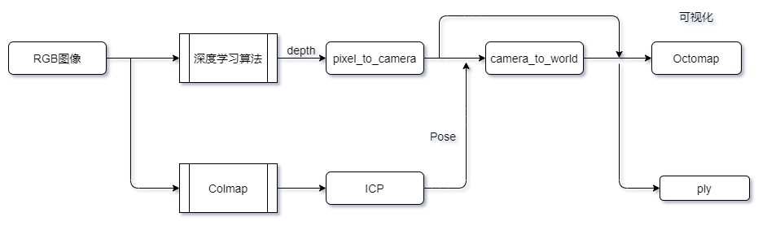

## 1 简介

基于图像的3D地图构建技术既是无人机智能化自主飞行的基础，同时也能够扩展应用到比如无人驾驶，三维地图构建，环境探索上面，具有广阔的应用前景和研究需要。

这份工作结合深度学习算法Monodepth2,PSMNet和传统算法Colmap实现了一个基于图像的无人机3D地图构建系统，并在另外的四个数据集上基于不同的输入输出分三种方式进行了实验。系统能够接受RGBD或者RGB图像的输入，输出场景的三维结构，并提供点云和八叉树两种储存方式与可视化效果。在KITTI数据集上的实验的结果表明，虽然系统的重建精度不及传统算法，但能够满足构建地图的需要，而且速度远超传统算法，鲁棒性也更加优秀。

因为疫情原因无法在真实的无人机上进行测试，论文利用Airsim构建虚拟场景，模拟无人机拍摄构建了户外数据集，并在系统上进行了测试。数据集的下载地址在data文件夹内。

## 2 系统说明

系统的大致分为五个部分：

- 深度图获取部分
- 相机位姿获取部分
- 像素坐标系转世界坐标系部分
- 相机坐标系转世界坐标系部分
- 储存与可视化部分

（1）	深度图获取部分
这部分主要是针对输入是RGB图像的任务，使用深度学习算法（毕业设计使用了monodepth2以及PSMNet）。估算每一幅图像的深度图或者视差图。同时这个部分可以使用真实的深度进行替代。

（2）	相机位姿获取部分
这部分使用Colmap以及ICP算法将每一幅图片的位姿估算出来。由于Colmap得到的位姿有尺度问题，因此在得到Colmap估计的位姿后，使用ICP算法对两张图片对应的点云进行匹配得到相对位姿，用这个相对位姿对Colmap得到的位姿进行尺度矫正。

（3）	像素坐标系转相机坐标系部分
这部分将输入的深度图或者视差图转化为相机坐标系的点云，可以将得到的点云输入可视化部分进行可视化。通过可视化得到的结果能够更好的观察深度估计的情况。

（4）	相机坐标系转世界坐标系部分
这部分将得到的相机坐标系的点云结合矫正后的Pose转化为在世界坐标系的点云。

（5）	储存与可视化部分
这个部分将得到的点云储存可视化出来，分为PLY部分以及Octomap部分。PLY部分使用三维坐标点方式储存点云，并使用Meshlab软件进行可视化。Octomap部分使用八叉树方式储存点云数据，并使用Octovis进行可视化。

## 3 相关依赖

python：3.6

相关的包在requirements.txt中，使用pip install -r requirements.txt 进行安装

C:

见有关的cmakelists

## 4 说明

### 4.1 使用了以下软件

相机位姿获取：Colmap

https://github.com/colmap/colmap

点云精确度对比：CloudCompare

PLY可视化软件：meshlab

八叉树实现：octomap库

### 4.2 各部分说明

**（1）monodepth2训练改写部分**

放在monodepth2文件夹中，只有修改过的文件，将这些文件对应替换到monodepth2里面就可以

其中数据集地址以及参数修改可以在options.py中进行修改

除此之外，需要编写train_files.txt以及val_files.txt进行训练，书写的代码和示例放在了interiornet_1_1子文件夹下

**（2）坐标系转换部分（包含PLY可视化）**

使用python编写，代码放在了transfer文件夹中。

主要由两个文件组成，一个是camera_to_world.py另外一个是pixel_to_camera.py

两个文件在开头写明了运行所需修改的地址

同时注意，文件里面的数据接口是针对depth以png格式给出，相机位姿以colmap给出，如果更换，需要重写数据接口

使用：地址与参数的修改都在内部，运行直接使用python ***.py即可

**（3）airsim数据集建立代码**

在airsim文件夹中

这里只提供了main.cpp，需要替换到2019年高飞无人机竞赛初赛的代码中去，下载地址见后文

使用:输入1,拍一张照片

注意保存地址需要在main.cpp中修改

下载地址：

**（4）octomap部分**

在octomap中，有两种实现方式，一种使用python，一种利用C在ROS中运行，具体的作用是将点云txt文件或者PLY文件转化为八叉树储存并保存为bt文件。

注意，需要octomap库

**（5） 其他工具**

放在other_tools文件夹中，有以下几个工具：

transfer_T_icp.py：将ICP得到的T来进行点云的合并

data_transfer.py：处理colmap dense重建得到的数据

ply_transfer_octomap：将PLY文件转化为八叉树文件

